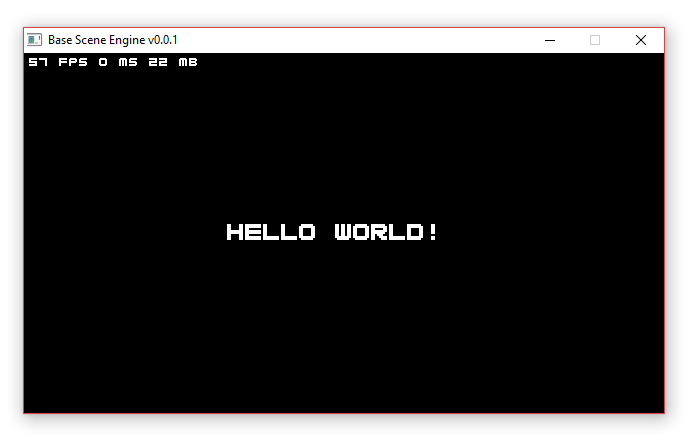

# SceneEngine

Scene-oriented 2D Java game engine using OpenGL (via [LWJGL](https://www.lwjgl.org/download)). 

Included `SEDemoMain.java` demonstrates a basic instantiation for 'Hello World!' display.

 

The engine updates and renders the current `Scene` (the first is provided in `getInitialGameScene()`), and the game should set a new one when required (logos, main menu, loading screens etc.) using `SceneManager.setScene()`.

LWJGL not supplied here, but should be configured in Eclipse to import `GLFW` etc.


## Features

- Single threaded update, render, repeat game loop.
- `EventBus` for simplified inter-object messaging, registering, broadcasting etc. Check classes for `Event`s available to listen for.
- `KeyboardManager` and `MouseManager` emit `Events` for user input.
- LWJGL-based OpenGL helpers for images, rects, etc in `GLHelpers` class.
- `FontRenderer` for bitmap-based string rendering in OpenGL. Fonts are implemented by extending `Font`. See `Blocky` for an example.
- `TileSheetParser` to load tiles/sprites/font characters as equally-sized bitmaps from a larger sheet. Parsed tiles are uploaded to OpenGL.
- `INIParser` class to read simple `.ini` files. Used in `ConfigManager` to handle config settings on initialization.
- `Logger` class to log debug info to console and output `.log` file. Includes crashing via assertion failure.


## Usage

To use the engine, simply call `Engine.start()` from `main()`, and supply some `EngineCallbacks` for essential events. After OpenGL has rendered its first frame, `onStartComplete()` will be called, allowing loading of textures, sprites, fonts, etc. A sample font bitmap is included, and is treated like a standard sprite sheet.

```java
String title = "Game Window";
Rectangle screenRect = new Rectangle(0, 0, 1280, 720);

Engine.start(title, screenRect, new EngineCallbacks() {
  
  @Override
    public void onStartComplete() {
      FontRenderer.setFont(new Blocky());
    }

    @Override
    public Scene getInitialScene() { return new HelloWorld(); }

    @Override
    public void onWindowClose() {
      System.exit(0);
    }
  
});
```


## Building a Game

Build your game using `Scene`s, rendering, and mouse and keyboard input using the `KeyboardManager` and `MouseManager` classes.

The engine will automatically loop the `onUpdate()` and `onDraw()` methods of the currently set `Scene`, so all things appearing in the scene should be looped similarly in these callbacks.

For example, the `HelloWorld.java` `Scene`:

```java
public class HelloWorld extends Scene {
  
  @Override
  public void onLoad() { }

  @Override
  public void onUpdate() { }

  @Override
  public void onDraw() {
    GLHelpers.pushNewColor(Color.WHITE);
    FontRenderer.drawString("Hello world!", BuildConfig.SCREEN_RECT, 16, Align.CENTER, Align.CENTER);
  }

}
```


## Using EventBus

Any object can broadcast or receive any kind of event with attached parameters (`EventParams`).

`Scene`s can manage `Event`s by automatically deregistering them when the `Scene` is not visible. This is useful for not navigating a menu while game is in play and so forth.

Example: When a key is pressed in `KeyboardManager`:

```java
public static void dispatchKeyEvent(int key, int action) {
  if(!enabled) return;

  boolean pressed = (action == GLFW.GLFW_PRESS) || (action == GLFW.GLFW_REPEAT);
  keys.put(key, pressed);
  
  EventBus.broadcast(Events.EVENT_KEY_CHANGE,
    new EventParams()
    .put(Events.PARAM_KEY, key)
    .put(Events.PARAM_STATE, pressed));
}
```

This event is received in `HelloWorld.java` and parsed by obtaining the params as specified by the emitting class: 

```java
// Register for keypresses
EventBus.register(new EventReceiver(KeyboardManager.Events.EVENT_KEY_CHANGE, false) {
  
  @Override
  public void onEvent(EventParams params) {
    int glfwKey = params.getInt(KeyboardManager.Events.PARAM_KEY);
    boolean pressed = params.getBoolean(KeyboardManager.Events.PARAM_STATE);
    
    // Escape to exit
    if(glfwKey == GLFW.GLFW_KEY_ESCAPE && !pressed) Engine.stop();
  }
  
});
```
